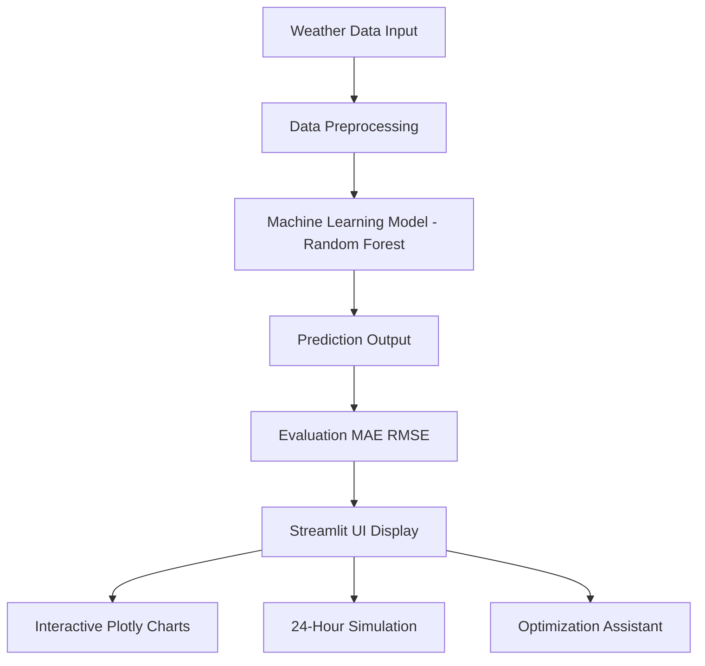

# ☀️ SolarVista — Solar Energy Forecasting Dashboard

AI-powered solar energy generation forecasting using Machine Learning and interactive data visualization.

## Features

- **Dashboard Overview** — Real-time metrics, power vs radiation curves, model accuracy gauge
- **Weather & Analytics** — Interactive weather input form with grouped parameters, instant ML predictions, 24-hour power simulation
- **Optimization Assistant** — AI-powered recommendations for maximizing solar output with performance reports

## Tech Stack

- **ML Model**: Random Forest Regressor (scikit-learn)
- **Frontend**: Streamlit with custom dark theme
- **Visualization**: Plotly (interactive charts, gauges, simulations)
- **Data**: 4200+ weather observation records

## Project Structure

```
solar_forecasting/
├── app.py                    # Main Streamlit dashboard
├── src/
│   ├── config.py             # App configuration and constants
│   └── ui/
│       ├── plots.py          # Plotly chart functions
│       └── components.py     # Reusable UI components
├── assets/
│   └── style.css             # Custom dark theme styling
├── data/
│   └── spg.csv               # Solar power generation dataset
├── models/
│   └── solar_model.pkl       # Trained Random Forest model
├── notebooks/
│   └── solar_forecasting.ipynb
├── .streamlit/
│   └── config.toml           # Streamlit theme config
└── requirements.txt
```

## Setup

```bash
pip install -r requirements.txt
streamlit run app.py
```

## System Architecture



## Team

Built as a group project for AI/ML coursework.