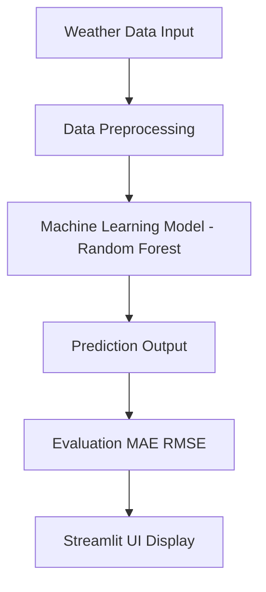

## System Architecture

```mermaid
flowchart TD
    A[Weather Data Input] --> B[Data Preprocessing]
    B --> C[Machine Learning Model - Random Forest]
    C --> D[Prediction Output]
    D --> E[Evaluation MAE RMSE]
    E --> F[Streamlit UI Display]
```