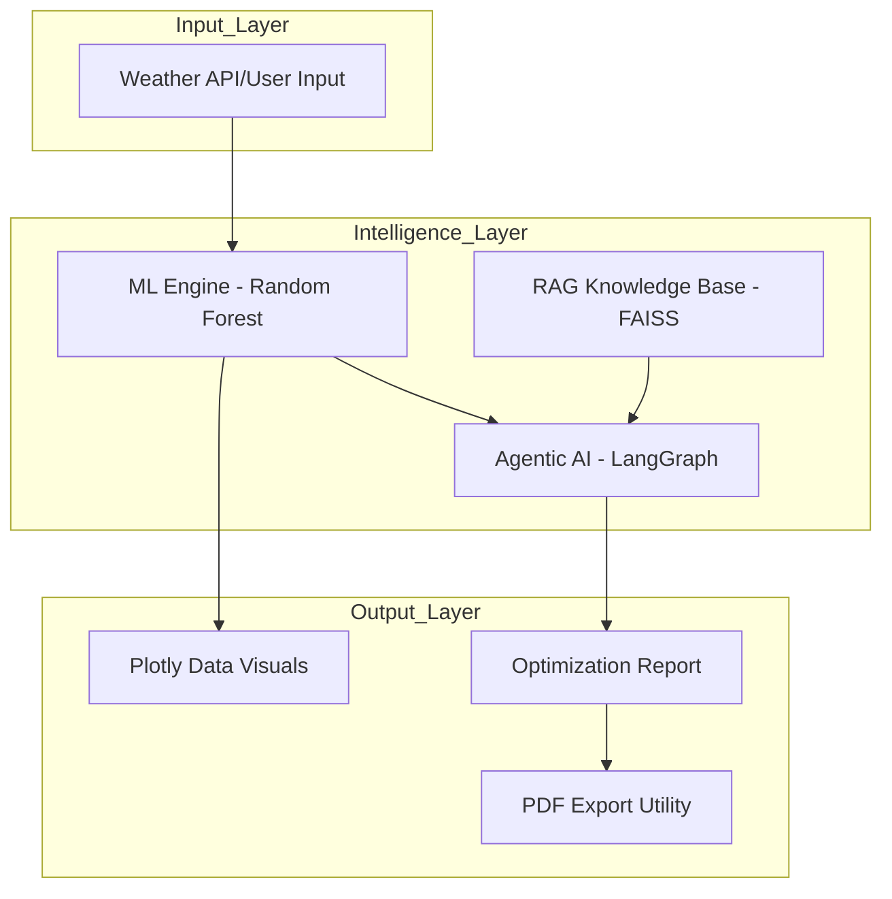

# ☀️ SolarVista — Intelligent Solar Management & Optimization

[](https://huggingface.co/spaces/) <!-- Placeholder for Dhiraj to add HF link -->
[](https://www.python.org/downloads/)
[](https://opensource.org/licenses/MIT)

**SolarVista** is an end-to-end AI-driven platform designed to forecast solar energy generation and provide agentic optimization strategies for smarter grid management. By combining high-accuracy Machine Learning with Large Language Models (LLMs), SolarVista transforms raw weather data into actionable energy intelligence.

---

## 🚀 Key Features

### 1. High-Accuracy Forecasting
- **ML Engine**: Optimized Random Forest Regressor trained on 4200+ meteorological records.
*   **Performance**: R² Score of **0.93** and MAE of **187.5 kW**.
- **Preprocessing**: Robust pipeline handling temperature, radiation, and sun geometry.

### 2. Agentic AI Optimization (Milestone 2)
- **"Ved" AI Assistant**: A reasoning engine built with **LangGraph** that analyzes forecasts to suggest grid maneuvers.
- **RAG Capability**: Uses **FAISS** vector search to ground AI advice in real-world grid stability guidelines.
- **Structured Reports**: AI generates JSON-based optimization plans covering Battery Management, Risk Assessment, and Load Balancing.

### 3. Professional Dashboard
- **Interactive Visuals**: Rich Plotly charts for power curves, accuracy gauges, and 24-hour simulations.
- **User-Centric Forms**: Grouped weather inputs for an intuitive desktop and mobile experience.
- **Extension**: Automated **PDF Export** for professional energy optimization reports.

---

## 🏗️ System Architecture



---

## 🛠️ Tech Stack

- **Frontend**: Streamlit, Custom CSS
- **Visualization**: Plotly
- **Machine Learning**: Scikit-Learn, Joblib, Pandas, Numpy
- **Agentic AI**: LangGraph, Google Gemini 1.5 Flash
- **Utility**: FPDF2 (PDF Generation), LangChain (RAG Framework)

---

## 📦 Setup & Installation

1. **Clone & Install**
   ```bash
   git clone <repo-url>
   pip install -r requirements.txt
   ```

2. **Configure API Keys**
   - Obtain a Gemini API Key from [Google AI Studio](https://makersuite.google.com/app/apikey).
   - Enter the key in the dashboard sidebar or set `GOOGLE_API_KEY` in your environment.

3. **Run Locally**
   ```bash
   streamlit run app.py
   ```

---

## 👥 The Team (Team 13)
- **Dhiraj (TL)**: Deployment, PDF Extension, & Documentation.
- **Shorya**: ML Engine & Preprocessing Pipeline.
- **Ved**: Agentic AI Workflow & RAG Logic.
- **Himanshu**: UI/UX Design & Dashboard Integration.

---

## 📝 Project Extension: Professional PDF Reporting
As part of our Milestone 2 extension, we have implemented a **Solar Optimization Report Generator**. This utility captures the AI's complex reasoning and the forecast metrics, formatting them into a professional document for utility operators and solar plant managers.